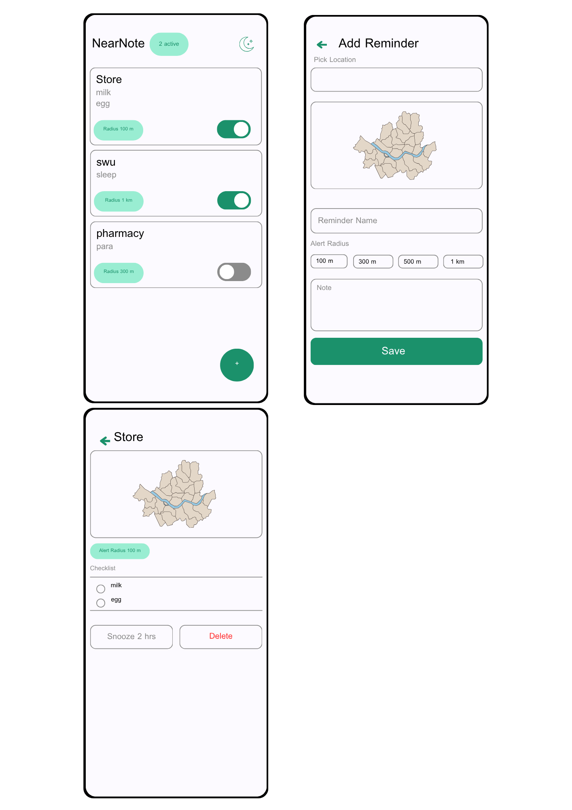

# NearNote 📍

**NearNote** คือแอป Android สำหรับตั้งการแจ้งเตือนตามสถานที่ — เมื่อคุณเข้าใกล้สถานที่ที่กำหนดไว้ แอปจะส่ง notification พร้อมโน้ตหรือรายการสิ่งที่ต้องทำ โดยไม่ต้องเปิดแอปค้างไว้



---

## 📖 ภาพรวมโปรเจ็ค

NearNote ถูกออกแบบมาเพื่อแก้ปัญหา "ลืมซื้อของเมื่อผ่านหน้าร้าน" หรือ "ลืมทำสิ่งที่ต้องทำเมื่อถึงที่หมาย"  
ผู้ใช้สามารถสร้าง Reminder ที่ผูกกับตำแหน่ง GPS พร้อมเขียนโน้ตหรือ checklist ไว้ล่วงหน้า  
เมื่อเข้าสู่รัศมีที่กำหนด แอปจะแจ้งเตือนทันที — แม้อยู่ใน background หรือหน้าจอดับ

---

## 🛠️ Tech Stack

| Layer | Technology |
|---|---|
| **Language** | Kotlin |
| **UI Framework** | Jetpack Compose + Material 3 |
| **Navigation** | Compose Navigation |
| **Local Database** | Room (SQLite) |
| **Location** | Google FusedLocationProviderClient |
| **Geofencing** | Google Geofencing API |
| **Maps** | Google Maps SDK for Android (Compose) |
| **Geocoding** | Android Geocoder API (offline-capable) |
| **Background Service** | Android Foreground Service (`START_STICKY`) |
| **Notifications** | NotificationCompat + NotificationChannel |
| **Min SDK** | API 26 (Android 8.0 Oreo) |

---

## ✨ Features

### 🗺️ สร้าง Location Reminder
- ค้นหาสถานที่ด้วยชื่อ หรือพิมพ์พิกัด (lat, lng) โดยตรง
- ค้นหาแบบ debounce (รอ 500ms) ผ่าน Android Geocoder API — ไม่ต้องพึ่ง internet API key
- แตะบนแผนที่เพื่อปักหมุดตำแหน่งได้เลย
- กำหนดรัศมีการแจ้งเตือน: **100 m / 300 m / 500 m / 1 km**
- ตั้งชื่อ Reminder และเขียน Notes/Checklist

### 📋 หน้าหลัก — รายการ Reminders
- แสดง Reminder ทั้งหมดพร้อม preview โน้ต และรัศมี
- Toggle เปิด/ปิดการแจ้งเตือนแต่ละ Reminder ได้อิสระ
- กดการ์ดเพื่อเข้าดูรายละเอียด
- Dark Mode toggle ที่มุมบนขวา

### 🔔 การแจ้งเตือน (Geofence Notification)
- ใช้ **Google Geofencing API** ตรวจจับการเข้าสู่พื้นที่ (`GEOFENCE_TRANSITION_ENTER`)
- แจ้งเตือนอัตโนมัติพร้อมชื่อสถานที่ + preview โน้ต
- Notification แบบ persistent — ไม่หายเมื่อกด ต้อง swipe ออกเอง
- มีปุ่ม **Snooze 2h** ใน notification shade — กดแล้วไม่แจ้งซ้ำ 2 ชั่วโมง
- กด notification เพื่อเปิด **DetailScreen** ของ Reminder นั้นโดยตรง

### 📄 Reminder Detail & Edit Mode
- แสดงแผนที่ + ตำแหน่งของ Reminder
- แสดงโน้ตในรูปแบบ **Checklist** ที่ติ๊กได้ (strikethrough เมื่อเสร็จ)
- **Edit Mode**: แก้ไขชื่อ, เพิ่ม/แก้ไข/ลบรายการใน checklist และบันทึกลง DB อัตโนมัติ
- ปุ่ม **Snooze 2 hrs** — หยุดแจ้งเตือนชั่วคราว
- ปุ่ม **Delete** พร้อม Confirmation Dialog
- ปุ่ม **Test Notification** สำหรับทดสอบ (developer mode)

### ⚙️ Background Reliability
- **LocationForegroundService** (`START_STICKY`) ทำงานอยู่ตลอดเวลา — แม้แอปถูกปิด OS ก็ restart ให้อัตโนมัติ
- **BootReceiver** — re-register Geofence ทุกครั้งที่อุปกรณ์รีสตาร์ท
- **GeofenceManager** — re-register geofence ทั้งหมดเมื่อ service เริ่มทำงาน ป้องกัน geofence หาย
- Location update ทุก 10 วินาที, ความแม่นยำสูง (`PRIORITY_HIGH_ACCURACY`) ทำให้ geofence ทำงานได้แม่นยำโดยไม่ต้องพึ่ง Google Maps

---

## 🏗️ โครงสร้างโปรเจ็ค

```
app/src/main/java/com/example/nearnote/
├── MainActivity.kt               # Entry point, Navigation host
├── data/
│   ├── local/
│   │   ├── ReminderEntity.kt     # Room Entity
│   │   ├── ReminderDao.kt        # DAO (CRUD operations)
│   │   └── NearNoteDatabase.kt   # Room Database singleton
│   └── repository/
│       └── ReminderRepository.kt # Data access layer
├── domain/
│   └── model/
│       └── Reminder.kt           # Domain model
├── service/
│   ├── GeofenceBroadcastReceiver.kt  # รับ Geofence event → ส่ง notification
│   ├── GeofenceManager.kt            # Add/Remove geofence
│   ├── GeofenceTransitionsService.kt # Foreground service สำหรับ transition
│   ├── LocationForegroundService.kt  # รักษา location updates ใน background
│   ├── BootReceiver.kt               # Re-register geofence หลัง reboot
│   └── SnoozeReceiver.kt             # จัดการ Snooze action จาก notification
└── ui/
    ├── home/                     # HomeScreen — รายการ Reminders
    ├── add/                      # AddReminderScreen — สร้าง Reminder ใหม่
    ├── detail/                   # DetailScreen — ดูและแก้ไข Reminder
    ├── theme/                    # Color, Typography, Theme
    └── ReminderViewModel.kt      # Shared ViewModel
```

---

## 🔐 Permissions

| Permission | ประโยชน์ |
|---|---|
| `ACCESS_FINE_LOCATION` | GPS แม่นยำสูง สำหรับ geofence |
| `ACCESS_COARSE_LOCATION` | Location fallback |
| `ACCESS_BACKGROUND_LOCATION` | ตรวจจับ geofence เมื่อแอปอยู่ background |
| `FOREGROUND_SERVICE` + `FOREGROUND_SERVICE_LOCATION` | รัน LocationForegroundService |
| `POST_NOTIFICATIONS` | ส่ง notification (Android 13+) |
| `RECEIVE_BOOT_COMPLETED` | Re-register geofence หลังรีบูต |

---

## 🚀 วิธีรัน

1. Clone repository นี้
2. เปิดด้วย **Android Studio Hedgehog** หรือใหม่กว่า
3. ใส่ Google Maps API Key ใน `AndroidManifest.xml` (หรือ `local.properties`)
4. รันบน Device หรือ Emulator ที่มี **Google Play Services**
5. อนุญาต Permission: Location (Always) และ Notifications

> ⚠️ **หมายเหตุ**: Geofencing ต้องการ Location Permission แบบ **"Always"** (Background Location) จึงจะทำงานได้เมื่อแอปปิดอยู่

---

## 📱 ความต้องการของระบบ

- **Android**: 8.0 (API 26) ขึ้นไป
- **Google Play Services**: จำเป็น (สำหรับ Geofencing และ Maps)
- **Internet**: ต้องการในครั้งแรกสำหรับโหลด Map tiles
